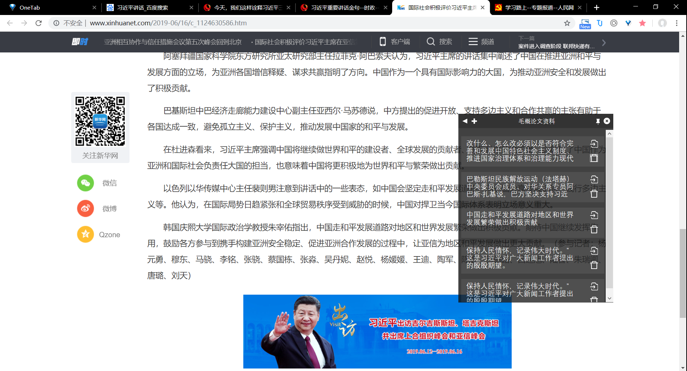
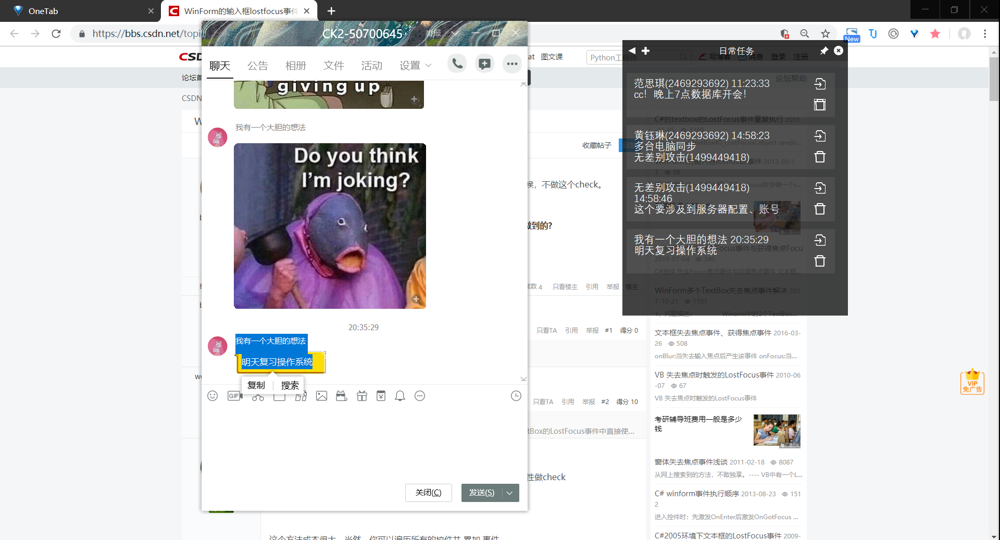

# 
Clever Note使用文档

    
HCI第9小组成员

    
郑超 1751747

    
黄钰琳 1751720

    
许靖宁 1751714

    
甘俊毅 1751697

    
吴思茜 1751703

## 开发环境
* 开发环境：Windows 10
* 开发语言：C#
* 开发工具：Visual Stuido 2019
## 使用说明
- 首先在设备上下载并安装 .Net Framework4.0。

  - [.Net Framework4.0 下载地址](https://www.microsoft.com/zh-cn/download/confirmation.aspx?id=17718)

- 打开“可执行文件”的文件夹中exe文件的快捷方式，或者根据路径“bin\Debug\”找到HCIFinal.exe执行。

## 基本操作
### 文件夹界面
- 打开界面后，点击主页面左上角【+号】，新建文件夹          
- 主页面右上角钉子图标用于设置是否将Clevewr Note设置为悬浮
- 鼠标【左键单击】文件夹可更改文件夹名称
- 鼠标【右键双击】文件夹进入文件夹标签界面

### 标签界面
- 点击标签页面左上角【+号】，新建标签
- 鼠标【左键单击】标签可编辑标签
- 点击标签上的【移动图标】可移动标签至另一文件夹
- 点击标签上的【删除图标】可删除标签

### 快捷键
- **F2快捷键**：将剪贴板内容发送到打开的文件夹中，形成新标签
- **F3快捷键**：快速地打开和关闭CleverNote

## 使用展示
### 当成资料收集的“工作区”
用户在进行论文写作时，需要查找参考文献并对其进行引用剖析。完成一篇成熟的论文，需要进行大量的材料搜集，同时还要对材料的内容进行摘抄节选。用户可选中需要进行记录参考文献及其节选内容，并按下快捷键，则内容可存储至软件中，等待用户的查看与使用。需要提取已存信息时，用户可打开软件，使用鼠标点击信息块，对相关内容进行编辑与操作。

### 在Clever Note上“规划”日程
用户在编辑报表或其他文件时，接收到同事发来的会议信息与准备材料的任务，可对接收到的信息进行一键暂存，如此不必中断手中的工作，同时将信息记录下来也不易忘记。若是收到上司发来的任务安排，在存储的同时，用户可将信息块置顶，位于其他信息块之前，有效地提醒任务的重要性。任务完成后可将不需要的信息块删除，保持界面的简洁度，无冗余信息。

