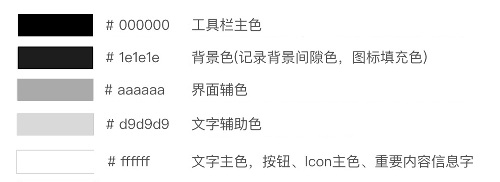
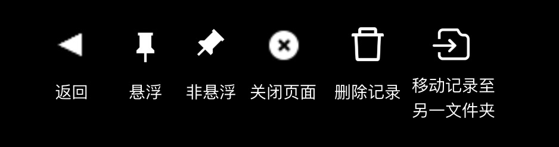
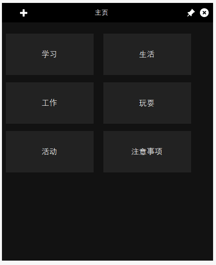
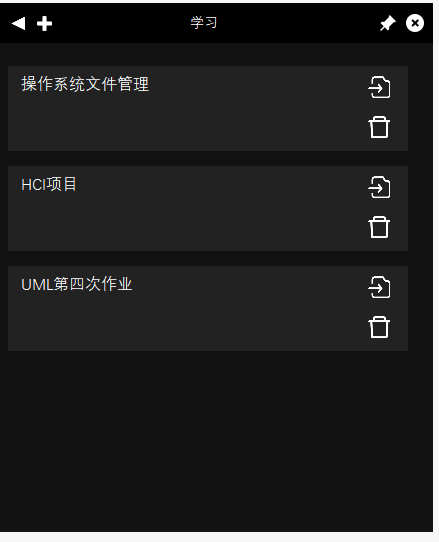

# <center>Clever Note开发文档</center>
<div style="text-align:center">
    <p style="font-size:19px; font-weight:bold;">HCI第9小组成员</p>
    <p style="font-size:15px; font-weight:bold;">郑超 1751747</p>
    <p style="font-size:15px; font-weight:bold;">黄钰琳 1751720</p>
    <p style="font-size:15px; font-weight:bold;">许靖宁 1751714</p>
    <p style="font-size:15px; font-weight:bold;">甘俊毅 1751697</p>
    <p style="font-size:15px; font-weight:bold;">吴思茜 1751703</p>
</div>

## 项目简介
“CleverNote”项目是一款为对工作、学习、生活有记录需求的电脑用户提供方便快捷的一键存储碎片信息的轻量便签软件。

比起市面上大多数的便签软件，“CleverNote”最大的特点即是其快速简洁的一键存储碎片信息的功能，脱离了大部分其他同类型产品的对浏览器插件的限制，本产品可应用于更多场合。

本项目立志于为经受零散信息折磨的广大用户提供便捷的存储服务，提升用户使用感，帮助用户在工作时进行信息记录。

## 项目设计及实现
### 基本窗口设计
**消息窗口——Form1**

核心类——item说明
```c++
public struct item       //todolist每一条的item
{
    public int id;          //item id
    public Label _l;        //消息label
    public Button _move;    //移动（调整分类）
    public Button _del;	    //删除按钮
    public TextBox _t;      //文本编辑框
};
```
成员变量说明
```c++
private Form2 fatherForm;       //主窗口
private int text_cont = 0;      //Item个数
public int f_id;                //窗口id
private string _title;          //窗口标题
public items _items;            //存放item的数组
```
函数说明
```c++
MovebuttonClick	        //移动按钮
DelbuttonClick	        //删除按钮
L_editClick             //Label→textbox
t_editClick             //Textbox→label
Mouse down/move/up      //完成移动item逻辑
```
**分类（文件）窗口——Form2**

核心类——ditem说明
```c++
public struct ditem         //todolist每一条的item
{
    public int id;          //item id
    public Label _l;        //消息label
    public TextBox _t;      //文本编辑框
};
```
成员变量说明
```c++
private Point mouse_offset;         //移动鼠标标记
public int text_cont = 0;           //文件夹（分类）个数
public bool is_moving = false;      //是否处于移动消息状态
public items _items;                //存放item的数组
Public Form1 sonForm;               //子窗口数组
```
函数说明
```c++
L_editClick             //Label→textbox
t_editClick             //Textbox→label
Mouse down/move/up      //完成移动ditem逻辑
```

### 信息本地存储
本项目在安装后会在本地生成一个专用txt文档用于储存所有的信息。程序在每次关闭之后会储存程序中所有动态生成的控件的关键信息，如文件的文件名，子消息的信息以及所属文件序号。

在动态生成控件时，同类控件将会被加入同一个Array list中，关闭程序时系统将从这些Array list中读取关键信息用于储存。打开程序时，系统会读取专用txt文件，根据其中信息将程序还原回上次关闭的状态。

具体的存储和还原的方式如下：将关键信息分信息类型存储，分别是文件名、子信息从属ID以及子信息内容，文件名的顺序与其ID直接对应，子信息从属ID既文件ID，子信息内容顺序和子信息从属ID直接对应。在关闭时调用SaveFile（）函数。

首先清空文件。
```c++
string str = System.IO.Directory.GetCurrentDirectory();
FileStream fs = new FileStream(str + "\\data.txt", FileMode.Open);
fs.Seek(0, SeekOrigin.Begin);
fs.SetLength(0);
fs.Close();
```
再将目前程序中的信息储存。
```c++
using (System.IO.StreamWriter file = new System.IO.StreamWriter((str + "\\data.txt"), true))
{
    for (int i = 0; i < _items.Count; i++)
    {
        object i_ditem = _items[i];
        ditem j_ditem = (ditem)i_ditem;
        file.WriteLine("@" + j_ditem._l.Text + "#");// 直接追加文件末尾，换行 
    }
    foreach (Form1 s in sonForm)
    {
        foreach (Form1.item i in s._items._item)
        {
            string id = Convert.ToString(s.f_id);
            file.WriteLine("文件序号：" + id + "#文件内容：" + i._l.Text + "#");
        }
    }
    file.Close();
}
```
不同信息分类由特殊符号表示，读取时根据特殊符号分类读取即可。此时调用Read方法进行还原。如以下的例子：
```c++
StreamReader sr = new StreamReader(path);
string[] result = Regex.Matches(File.ReadAllText(path), @"(?<=@).*?(?=#)").Cast<Match>().Select(S => S.Value.Trim()).ToArray();
```
之后分别根据不同类型信息增加控件即可。
```c++
this.panel2.VerticalScroll.Value = panel2.VerticalScroll.Minimum;   //滚动条
Label l = new Label();                                               //文本框label
l.BorderStyle = System.Windows.Forms.BorderStyle.Fixed3D;
l.Location = new System.Drawing.Point(8 + (text_cont % 2) * 200, 18 + (text_cont / 2) * 100);

l.Name = "新文件夹";
l.Size = new System.Drawing.Size(180, 85);
l.TabIndex = 6;
l.Text = line;
```

### 快捷键功能实现
**设计初步想法**

在项目构想当中，我们设想将会有一个全局的快捷键可以迅速地将剪贴板中的内容发送到CleverNote当中，并在当前文件夹目录下根据内容生成一个新的标签。

同时，为了提高使用体验，我们设想使用另一个快捷键，可以迅速地隐藏/显示窗口。在使用过程中，即可以快速地获取信息，也可以在不必要的时候迅速隐藏窗口，减少界面的占用。

**设计实现**

C# Winform中可以import系统文件user32.dll。该文件提供了注册系统热键的接口。
```c++
[DllImport("user32.dll", SetLastError = true)]
public static extern bool RegisterHotKey(IntPtr hWnd, int id, KeyModifiers fsModifiers, Keys vk);
[DllImport("user32.dll", SetLastError = true)]
public static extern bool UnregisterHotKey(IntPtr hWnd, int id);
```
注册F2为根据剪贴板内容新建标签的热键，注册F3为隐藏/显示窗口的热键。
```c++
//F2
RegisterHotKey(Handle, 990316, 0, Keys.F2);
//F3
RegisterHotKey(Handle, 990803, 0, Keys.F3);
```
首先应获取剪贴板内容。恰巧的是，WinForm中直接提供了系统的Clipboard实体类，因此写了一个getClipMsg()的函数返回剪贴板内容。
```c++
private string getClipMsg()
{
    IDataObject iData = Clipboard.GetDataObject();
    if (iData.GetDataPresent(DataFormats.Text)) return(String)iData.GetData(DataFormats.Text);
    else return "无法从剪贴板获取数据。";
}
```
重载WndProc()函数，响应热键事件。
```c++
protected override void WndProc(ref Message m)
{
    switch(m.Msg)
    {
            ......
        case 0x0312://热键
            HotKeyReact(m.WParam.ToInt32());
            break;
        default:
            base.WndProc(ref m);
            break;
    }
}
private void HotKeyReact(int m)
{
    switch (m)
    {
        case 990316:                    //F2
            MOVE_ADD(getClipMsg());     //增加标签
            break;
        case 990803:                    //F3
            if (this.WindowState == FormWindowState.Minimized) this.WindowState = FormWindowState.Normal;
            else this.WindowState = FormWindowState.Minimized;
            break;
    }
}
```
最终在退出程序时，应及时注销热键。
```c++
UnregisterHotKey(Handle, 990316);
UnregisterHotKey(Handle, 990803);
```


### UI优化设计
#### 界面展示
- 标准色



- 图标



- 主界面[普通/命名]



- 消息界面[普通/命名/移动]



#### 界面设计
**统一的视觉风格**

采用扁平化风格，强调抽象的符号化，力求优美简约，与当下设计风格从拟物化设计转向扁平化设计的风格潮流相契合。
       
- **颜色**：整体色调借鉴中华书法的黑白之美，使用黑-白-灰的简约色块，与PC端色彩斑斓的大量网页形成鲜明对比。没有了其他颜色的干扰，画面表现更简洁纯粹，用户的注意力被拉回所记录的内容本身，极大地满足用户的需求。

- **线条**：统一采用等线字体，追求均匀和谐的线条美，线条粗细有致，黑色背景强化白色线条的表现力，达到主次分明、高反差的视觉效果。

- **图案**：与Win10系统的Metro方块风格相吻合，使用极简的矩形元素来表现明确清晰的内容，在复调中强化元素统一的特色与风格。同时黑白灰模式的色彩均衡，强化了界面图案中线条、纹路、质感的表现力。

**用户体验**

采用**KISS原则**，Keep it Simple and Stupid，致力于提升用户视觉舒适度，简约化用户的理解与使用，具体表现为尽量减少图形细节的数量，采用抽象简约的符号化表达方式；限制颜色使用数量，每个图标控制在同一色系的的颜色分别进行描边与填充。          

- 通过采用优美、简约的通用性符号元素，去除了冗余的装饰效果，将实体世界的外部特征剥离，抽象出富有表现张力的元素，让用户需要记录的“信息” 本身作为核心被更好地凸显，尽可能地保持设计的概要性。

**一致性**                       

一致性主要体现在三个方面。                
- **与系列产品保持一致性**。轻量级的Clever Note采用通用性图标与用户进行交互，用户仅凭视觉元素也能迅速理解和使用，功能实用而便捷。

- **与应用背景保持一致性**。将使用场景确立后，从用户视图出发，重视其审美性与可用性，追求所记录信息的醒目明确，简洁优雅的界面优化视觉和使用体验，能够有效减少认知和理解的障碍，也能够与Clever Note的应用场景相契合。

- **Clever Note内部设计风格保持一致性**。在线条粗细、线条颜色、图案均衡性等多处细节进行处理，保持了整体统一的视觉风格。
     
## 其它可扩展的功能
### 云端同步
可以利用个人账户实现多设备上的同步，解决不同设备上信息不一致的问题，做到信息保存全面。
### 文件类型多样化
可以保存如图片、语音、视频等多类型的文件，丰富长文本便签的内容，实现保存内容的多样化，免去图片语音转化文字的麻烦。
### 一键导出
可同时勾选多个文件块，选中一键导出，可以将其中的内容同时导出到用户的剪切板中，进行再利用。

## 项目分工

郑超：快捷键实现 20%

许靖宁：基本窗体构建 20%

甘俊毅：本地保存实现 20%

黄钰琳：UI实现 20%

吴思茜：答辩PPT 20%